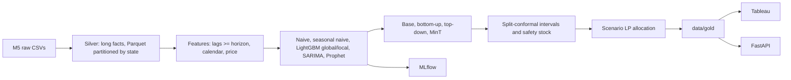

# Hierarchical Demand Forecasting and Allocation Platform

This project forecasts daily retail demand across the M5 (Walmart) hierarchy, reconciles the forecasts so every level adds up, attaches calibrated prediction intervals, and allocates constrained inventory with a linear program. Modelling and reporting are kept separate: the pipeline writes gold tables, and those tables feed a FastAPI service and Tableau.

## Architecture



## Quickstart

```bash
cd demand-forecast-platform
python -m pip install -e ".[prophet,api,data,dev]"
# macOS: LightGBM needs OpenMP -> brew install libomp

python scripts/download_data.py          # M5 from a pinned public mirror; no account needed

python -m forecasting --states CA        # raw -> silver (about 45 s, 1.8 GB peak)
python -m forecasting.pipeline           # silver -> gold + MLflow (about 15 min on an 8 GB M1)
python -m pytest -q                      # 34 tests, including an end-to-end run on synthetic M5
uvicorn api.main:app                     # /get-forecast, /get-prediction-interval, /get-allocation, /get-metrics
mlflow ui --backend-store-uri sqlite:///mlruns/mlflow.db
```

`python -m forecasting.pipeline --help` lists the options: `--states CA TX WI`, `--history-days`, `--folds`, `--estimators`, `--max-items` for a quick run, `--no-prophet` and `--no-mlflow`.

## Evaluation design

- **Scope.** The run covers California: 4 stores, 12,196 item-store series and 46 aggregate nodes (department×store, category×store, store, state, total). All figures below are WMAPE.
- **Folds.** There are three rolling-origin backtest folds of 28 days each (origins 2016-01-31, 02-28, 03-27). They are followed by a **holdout** on the M5 validation window, 2016-04-25 → 2016-05-22, scored against the real actuals in `sales_train_evaluation.csv`.
- **Model selection** uses only the backtest folds, both for the bottom-level model (item-level WMAPE) and for the served reconciliation method (WRMSSE). The holdout is never used for any decision.
- **Leakage.** Every lag and rolling feature is shifted by at least the 28-day horizon, so one direct model scores the whole horizon without recursion and without leaking future actuals.
- **Intervals** are split-conformal. Scores are signed and scale-normalised, and each fold is calibrated **only on earlier folds**, so the reported coverage is out-of-sample.
- **Production** trains on everything through 2016-05-22 and forecasts 2016-05-23 → 2016-06-19. That forecast is what the API and Tableau serve.

## Findings (California, holdout window)

**1. LightGBM beats the naive floors at the SKU level, and one global model beats per-store models.**

| Item × store WMAPE | Backtest mean | Holdout |
|---|---|---|
| Naive | 1.048 | 1.002 |
| Seasonal naive | 0.892 | 0.875 |
| LightGBM, local (one per store) | 0.746 | 0.734 |
| **LightGBM, global** | **0.745** | **0.727** |

The global model is 17% better than seasonal naive at the SKU level. Global and local are almost tied at the SKU level, but global is clearly better once aggregated: store-level WMAPE is 0.086 vs 0.111 on the holdout. So pooling across stores helps.

**2. Reconciliation: a direct SARIMA model beats every coherent forecast at the aggregate levels. Out-of-sample MinT is the best coherent method on the holdout, but it wasn't chosen.**

WMAPE on the holdout:

| Level | Base (SARIMA aggregates) | Bottom-up | Top-down | MinT, in-sample weights | MinT, out-of-sample weights |
|---|---|---|---|---|---|
| Total / state | **0.046** | 0.069 | **0.046** | 0.064 | 0.059 |
| Store | **0.058** | 0.086 | 0.087 | 0.079 | 0.072 |
| Category × store | **0.069** | 0.099 | 0.096 | 0.090 | 0.083 |
| Department × store | **0.086** | 0.113 | 0.115 | 0.105 | 0.099 |
| Item × store | 0.727 | 0.727 | 0.750 | 0.727 | 0.728 |
| **WRMSSE (mean of 6 levels)** | **0.492** | 0.607 | 0.589 | 0.565 | 0.536 |

- **MinT category-level WMAPE is 0.090 on the holdout**, 9% better than bottom-up (0.099). Weighting MinT by each base model's squared error in the *previous* 28-day window, instead of by in-sample residuals, brings it to 0.083. The out-of-sample weights are better at every aggregate level, because in-sample LightGBM residuals are overconfident and over-weight the biased bottom level.
- The LightGBM bottom level carries a **−6.7% bias**: it under-forecasts, mostly the weekend peaks (see the notebook). In-sample MinT corrects it to −5.8%, and out-of-sample MinT to −5.0%.
- **Which method is served is decided before the holdout is looked at.** The rule is the lowest backtest WRMSSE among the coherent methods. It chose in-sample MinT by a hair (0.532 vs 0.535 on backtests 2–3), so that is what the API serves, even though the holdout favours the out-of-sample weights. Switching after seeing the holdout would leak it into the choice.
- The un-reconciled SARIMA aggregates are the most accurate, but they are *incoherent*: store forecasts don't add up to the state. A planner needs numbers that add up, so a coherent method is served.
- WRMSSE here follows the M5 formula: naive-scaled RMSE per node, revenue weights, and equal weight per level. It covers only the 6 levels of a California-only hierarchy, so it is **not comparable to the M5 leaderboard**, which uses 12 levels across all states.

**3. Intervals (for the served method) are well calibrated at the SKU level and slightly narrow at the aggregate levels.**

| Level | 80% nominal | 95% nominal |
|---|---|---|
| Item × store | 0.804 | 0.953 |
| Department × store | 0.769 | 0.942 |
| Store | 0.738 | 0.926 |
| Total | 0.786 | 0.929 |

Figures are mean empirical coverage over the folds that had earlier calibration data. The aggregate levels calibrate on only a few nodes × 28 days per fold, so their coverage is noisier and a few points under nominal.

**4. The scenario LP beats a pro-rata split on revenue in all 12 of 12 evaluated weeks.**

The setup: each week the DC holds only 90% of the forecast demand for the 28 department × store nodes. The LP maximises expected fulfilled revenue over conformal demand scenarios. Both policies are scored on realised demand.

| Policy | Revenue fulfilled | Unit fill rate | Node stockouts |
|---|---|---|---|
| Pro-rata | baseline | 86.1% | 308 |
| **Scenario LP** | **+1.57%** | 85.3% | **255** |

The LP deliberately trades 0.8 points of unit fill rate for higher-value units, and it has 17% fewer node stockouts. It won every week, by between +0.07% and +2.5%.

**5. Drift is stable.** Demand-mix PSI and residual PSI are both ≤ 0.03 for every store, far below the 0.2 alert threshold. Store-level WMAPE rose 5.7% on the holdout, under the 10% retrain trigger, so the retraining flag is off.

## Components

| Module | What it does |
|---|---|
| `forecasting.data` | M5 ingestion (category dtypes, per-state processing), silver Parquet, explicit six-level hierarchy with vectorised node IDs |
| `forecasting.features` | Leakage-safe lags and rolling statistics (shift ≥ horizon), calendar, SNAP, events, price ratio and price change |
| `forecasting.models` | Naive and seasonal-naive floors, SARIMA, Prophet with M5 events as holidays, LightGBM Tweedie (global, and local per store) |
| `forecasting.reconciliation` | Sparse summing matrix; bottom-up; Gross–Sohl top-down; dense MinT; **diagonal MinT via the Woodbury identity**, which inverts 46×46 instead of 12,196×12,196, with in-sample or out-of-sample weights |
| `forecasting.probabilistic` | Split-conformal intervals, service-level safety stock, stockout risk, demand scenarios |
| `forecasting.allocation` | Newsvendor-style scenario LP in PuLP (HiGHS solver) with a pro-rata benchmark |
| `forecasting.drift` | PSI with open-ended bins, and a retraining flag combining PSI with WMAPE decay |
| `forecasting.pipeline` | Orchestration, fold design, gold tables, MLflow logging |
| `api/main.py` | FastAPI endpoints with filtering and pagination |
| `tableau/README.md` | Data sources, joins, suggested dashboard, calculated fields |
| `notebooks/walkthrough.ipynb` | Executed walkthrough of every result above |

## Data provenance

`scripts/download_data.py` fetches the M5 files from Nixtla's public mirror (`github.com/Nixtla/m5-forecasts`, the archive behind `datasetsforecast`), so the project reproduces without a Kaggle account. The archive is pinned by SHA-256, and the script refuses to continue unless the files match the official M5 shapes: 30,490 series, d_1–d_1941, 1,969 calendar days and 6,841,121 price rows.

The mirror drops the `id` column from sales and the `d` column from the calendar. `load_m5` rebuilds `d` from date order, which is exactly how the official file defines it. `python scripts/download_data.py --source kaggle` uses the official competition download instead, which needs the competition rules to be accepted; no code changes are needed either way.

## Next steps

- Close the rest of the gap to SARIMA at the aggregate levels:
  - Add bias correction or a trend feature to LightGBM.
  - Try a shrinkage-covariance MinT restricted to the aggregate levels.
  - Pool out-of-sample errors across several past windows. The current weights use a single 28-day window, which is why the backtest choice between the two MinT variants was nearly a tie.
- Extend to TX and WI, which means running `--states CA TX WI` on a machine with more than 8 GB of RAM. That also gives the full 12-level M5 WRMSSE.
