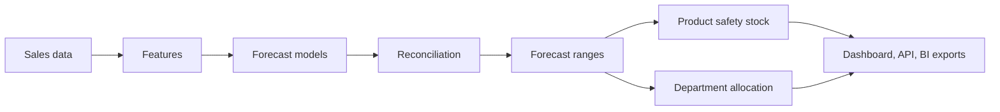

# Hierarchical Demand Forecasting and Allocation Platform

**[▶ Live dashboard](https://advaithvemurisai-demand-forecast-platform-dashboardapp-wh5iys.streamlit.app/)**

## The business problem

A retailer has to decide how much of each product to stock and which stores get it. Two things make that hard:

- **Plans at different levels disagree.** Buyers plan categories, store managers plan their store, and the supply chain plans the region. Forecast each level separately and the numbers don't add up, so teams order against conflicting plans.
- **Supply is often short.** When the warehouse can't cover every store, someone has to decide who goes without. A simple proportional split ignores which units are most likely to sell and what they're worth.

Too little stock loses sales; too much ties up cash. This project builds the pipeline a planning team would use to handle both problems, on real Walmart sales data (the M5 competition dataset, California stores).

## What's being forecast

**Daily unit sales of 3,049 Walmart products in each of 4 California stores, 28 days ahead.** The products span three categories:

| Category | Products | Departments |
|---|---|---|
| Foods | 1,437 | 3 |
| Household | 1,047 | 2 |
| Hobbies | 565 | 2 |

That is 12,196 product-store combinations, rolled up into departments, categories, stores and the state total. The data is the public M5 competition dataset. Walmart anonymised the product names, so items appear as codes such as `FOODS_3_090`.

## What each step solves

| Step | Business question | Result |
|---|---|---|
| **Forecast** | How much will each product sell in each store, day by day, over the next four weeks? | 17% lower product-level error than repeating last week's sales |
| **Reconcile** | Do the item, store and regional plans agree? | Forecasts add up at every level, and are more accurate than simply adding up item forecasts |
| **Quantify uncertainty** | How sure are we, and how bad could it get? | 95% forecast ranges contain about 95% of actual sales |
| **Safety stock** | How much buffer does each product need in each store? | A stock target for every product at a 95% service level |
| **Allocate** | When the warehouse is short, which departments in which stores get the stock each week? | +1.6% revenue and 17% fewer stockouts than a proportional split |
| **Monitor** | Has demand shifted enough to retrain? | Automated drift check with a retraining flag |

### Reconciliation in plain terms

The platform uses **MinT reconciliation**. It takes forecasts from every level and finds the closest set of numbers that add up exactly. Forecasts with a good track record barely move; unreliable ones absorb most of the correction. The result is one consistent plan that every team can work from, more accurate than either building up from items or splitting down from the total.

## How it's built



- **Models:** one LightGBM model forecasts every product in every store. Department, category, store and state forecasts are the product forecasts added up, then reconciled with classical time-series (SARIMA) forecasts made directly at those levels.
- **Evaluation:** tested on several past periods, then on a final held-out period that was never used to make any modelling choice.
- **Allocation:** each week, one warehouse supplies the 4 stores with only 90% of forecast demand, a simulated shortage. An optimisation model splits that supply across the 28 department × store combinations (7 departments × 4 stores), weighing each unit's chance of selling against the department's average selling price. A **stockout** is a department in a store whose actual demand that week exceeded what it was sent. Over 12 test weeks there were 255 of these under the optimiser vs 308 under a proportional split.
- **Delivery:** results feed a Streamlit dashboard, a FastAPI service and Tableau / Looker Studio exports; runs are tracked in MLflow.

The [walkthrough notebook](notebooks/walkthrough.ipynb) has the full results and methodology.

## Honest limitations

- A classical model forecasting the store and regional totals directly is more accurate at those levels, but its numbers don't add up across the hierarchy, so it can't be used as a plan.
- The item-level model slightly under-forecasts, mostly on weekend peaks.
- Allocation is by department, not by individual product, and it doesn't use the product-level safety stock; a real warehouse ships individual products.
- The run covers California only; extending to all states needs more memory than a laptop.

## Run it

```bash
python -m pip install -e ".[prophet,api,data,dev]"   # macOS: brew install libomp
python scripts/download_data.py                      # downloads and verifies the M5 data
python -m forecasting --states CA                    # prepare the data
python -m forecasting.pipeline                       # train, evaluate and write results
python -m pytest -q
streamlit run dashboard/app.py                       # dashboard
uvicorn api.main:app                                 # API
```

The hosted dashboard reads a small extract committed in `data/dashboard/`, so it needs neither the raw data nor the modelling stack. See [tableau/README.md](tableau/README.md) and [looker_studio/](looker_studio/) for the BI versions.
