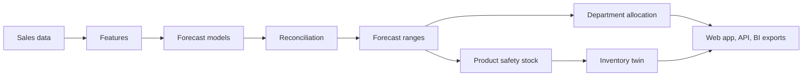

# Hierarchical Demand Forecasting, Allocation and Inventory Twin

**[▶ Live dashboard (Streamlit)](https://advaithvemurisai-demand-forecast-platform-dashboardapp-wh5iys.streamlit.app/)** · a static web app with an in-browser inventory simulator lives in [`web/`](web/) (see [Deploy](#deploy)).

## The business problem

A retailer has to decide how much of each product to stock and which stores get it. Three things make that hard:

- **Plans at different levels disagree.** Buyers plan categories, store managers plan their store, and the supply chain plans the region. Forecast each level separately and the numbers don't add up, so teams order against conflicting plans.
- **Supply is often short.** When the warehouse can't cover every store, someone has to decide who goes without. A proportional split ignores which units are most likely to sell and what they're worth.
- **Nobody can test a policy before living with it.** What does a demand spike, a late supplier or a different service target do to stock, sales and cash? The answer is usually found out on the shelf.

Too little stock loses sales; too much ties up cash. This project builds the pipeline a planning team would use for all three, on real Walmart sales data (the M5 competition dataset, California stores).

## What's being forecast

**Daily unit sales of 3,049 Walmart products in each of 4 California stores, 28 days ahead.** The products span three categories:

| Category | Products | Departments |
|---|---|---|
| Foods | 1,437 | 3 |
| Household | 1,047 | 2 |
| Hobbies | 565 | 2 |

That is 12,196 product-store combinations, rolled up into departments, categories, stores and the state total. Walmart anonymised the product names, so items appear as codes such as `FOODS_3_090`.

## What each step solves

Holdout = a final 28-day window never used for any modelling choice. Numbers are from the committed run (`data/dashboard/`).

| Step | Business question | Result |
|---|---|---|
| **Forecast** | How much will each product sell in each store, day by day, over four weeks? | 14% lower product-level error than repeating last week's sales |
| **Reconcile** | Do the item, store and regional plans agree? | Forecasts add up at every level; category error 15% lower than adding up item forecasts (WRMSSE 0.448) |
| **Quantify uncertainty** | How sure are we, and how bad could it get? | 95% ranges contain 94.1% of item sales; aggregate levels run narrower (92.4–94.0%) |
| **Safety stock** | How much buffer does each product need over its replenishment window? | A stock target per product: lead time + days between orders, service targets by value × variability class, shelf minimum, case packs |
| **Allocate** | When the warehouse is short, which departments in which stores get the stock? | +0.7% revenue and 7.7% less lost revenue than a proportional split, no department starved |
| **Simulate** | What happens to stock, service and cash under a policy, a demand spike or a supply problem? | Day-by-day inventory twin with validated service levels and stress tests (below) |
| **Monitor** | Has demand shifted enough to retrain? | PSI and accuracy-decay checks, plus a twin-divergence check |

### Reconciliation in plain terms

The platform uses **MinT reconciliation**. It takes forecasts from every level and finds the closest set of numbers that add up exactly. Forecasts with a good track record barely move; unreliable ones absorb most of the correction. The result is one consistent plan every team can work from, more accurate than building up from items.

## The inventory digital twin

A stateful, vectorised simulation of **supplier → California distribution centre → 4 stores × 3,049 products**, one day at a time: receive in-transit stock, sell (lost sales when the shelf is empty), order up to a policy target on review days, and ration what the DC has when it is short. The DC reorders weekly against the *aggregate* forecast, so the reconciled plan is what sets warehouse stock. It follows supply-chain digital-twin practice: one narrow use case with KPIs defined first, validation against history, replications with confidence bands, and a maturity path from descriptive to prescriptive.

| Level | What it does | Where |
|---|---|---|
| **Descriptive** | Replays a window on actual sales: on-hand, demand and lost sales per store × department | `twin_timeline` |
| **Diagnostic** | Flags probable stockouts (steady sellers only) and tracks how far the twin drifts from reality | `probable_stockouts`, `twin_validation` |
| **Predictive** | Simulates 50 futures from forecast and calibration data alone, then compares with what happened | `twin_validation` |
| **Prescriptive** | Cost-optimal service level per category, three stress tests, and a stockout watch-list | `twin_frontier`, `twin_stress`, `twin_exceptions` |

**What the twin says on the California data**

- **Service levels are predicted well; bands are overconfident.** Across three windows the predicted fill rate is off by 0.8 pts on average and in-stock by 0.2 pts (latest window: 97.2% predicted vs 97.4% realised). But the realised result fell inside the 90% band in only **1 of 18** checks: the bands come from just 4–16 historical weeks, so they are too narrow.
- **Dollar losses are overstated about 2×.** Predicted demand runs ~8% above observed sales, and observed sales are themselves held down by real stockouts. Lost sales is a tail quantity, so read dollar figures as policy-vs-policy comparisons, not absolute forecasts.
- **Forecast-based reordering beats current practice, at a price in stock.** Replaying the holdout window on what actually sold, reordering from the forecast (plus conformal safety stock) vs from last week's sales gives fill rate 97.5% vs 84.7% and lost sales $42k vs $253k across the four stores, while holding $577k vs $189k of inventory. Whether that extra stock is worth it is the next point.
- **Cheapest service targets differ by category:** Foods 95% (spoilage makes stock expensive to hold), Hobbies 98%, Household 99%, each 4–9% cheaper in lost margin + holding cost than today's segment targets.
- **Supplier delay is the dominant risk.** A 7-day-late supplier cuts fill rate by 9.5 pts and adds ~$180k of lost sales over four weeks; a holiday-style +50% Foods spike adds ~$16k; a 30% warehouse shortfall ~$6k. The size of the supplier effect depends on the assumed DC safety stock (10% of cover demand).

The simulator is one numpy-only file, [`src/forecasting/twin.py`](src/forecasting/twin.py). The pipeline, the API and the browser all run that same file (the browser through Pyodide), and a parity test checks CPython and WebAssembly agree to 1e-6.

## How it's built


```mermaid
flowchart LR
    D[Sales data] --> F[Features]
    F --> M[Forecast models]
    M --> R[Reconciliation]
    R --> P[Forecast ranges]
    P --> S[Product safety stock]
    P --> A[Department allocation]
    S --> T[Inventory twin]
    A --> O[Web app, API, BI exports]
    T --> O
```

- **Models:** one LightGBM model forecasts every product in every store, trained without days a steady seller was probably out of stock (6% of training rows). Department, category, store and state forecasts are the product forecasts added up, then reconciled with classical SARIMA forecasts made directly at those levels. Closed days (Christmas) are forecast at zero, and events carry distance-to-event features.
- **Evaluation:** three rolling-origin backtests, then a held-out final window never used for any modelling choice.
- **Intervals:** split-conformal, calibrated separately per segment (Mondrian: items by speed class and category, departments by category), out-of-sample.
- **Allocation:** each week one warehouse supplies the 4 stores with 90% of forecast demand, a simulated shortage. An optimisation model splits it across 28 department × store targets, maximising expected *margin* (assumed by category) over demand scenarios, with every target held to at least half its forecast so none is starved. Over 12 test weeks it earned more than a proportional split in 11, a mean +$2.7k per week (95% CI $1.2k to $4.1k), and left 7.7% less revenue unfilled, while fulfilling 0.9% fewer units: it favours margin over unit count.
- **Decision-grain accuracy:** forecasts are also scored over each product's replenishment window, with bias by weekday, event days, and a tracking-signal exceptions list of products the forecast keeps missing in one direction.
- **Delivery:** a static React app ([`web/`](web/)), a FastAPI service ([`api/`](api/)), a Streamlit dashboard, Tableau / Looker Studio exports, and MLflow run tracking.

## Honest limitations

- **M5 has no inventory, lead-time, cost or case-pack data.** The twin's starting stock, lead times, margins (by category) and holding costs (including food spoilage) are assumptions set in `pipeline.Config`, not measurements.
- **M5 records sales, not demand.** A zero can mean no demand or no stock. Only steady sellers (≥1 unit/day) are judged by a Poisson zero-run test (≈4% of days flagged); a looser rule flagged 19% and biased the model upward. Some censoring remains, so item-level WMAPE (0.743, vs 0.727 before masking) is measured against sales that are themselves censored.
- **Twin bands are too narrow** (see above), and demand scenarios resample past weeks per product, so cross-product correlation within a week is kept but only as far as the few available weeks allow.
- **Aggregate intervals under-cover.** At 95% nominal, store coverage is 92.6% and category 92.4%; at 80% nominal, state/total/store cover about 71%.
- **Item-level accuracy is modest** (WMAPE 0.74 daily; 0.30–0.36 for fast sellers over their replenishment window, above 1.0 for sporadic ones). The product model under-forecasts sporadic and slow sellers and is biased up on fast Household items.
- **Temporal reconciliation did not help.** Pulling aggregate daily forecasts toward weekly ARIMA forecasts made the base SARIMA slightly worse (state WMAPE 0.0502 vs 0.0462) and left reconciled accuracy unchanged, so it is off by default (`--temporal`).
- **The override demo is automatic, not planner input.** A bias-correction rule for products with a persistent tracking signal adds value on the products it flags (FVA +2 to +11 pts WMAPE) and a negligible amount overall; real planner overrides would need real data.
- A classical model forecasting the store and regional totals directly can be more accurate at those levels, but its numbers don't add up across the hierarchy, so it can't be used as a plan.
- The run covers California only; extending to all states needs more memory than a laptop.

## Run it

```bash
python -m pip install -e ".[prophet,api,data,dev]"   # macOS: brew install libomp
python scripts/download_data.py                      # downloads and verifies the M5 data
python -m forecasting --states CA                    # prepare the data
python -m forecasting.pipeline                       # train, evaluate, simulate, write results (~16 min on a laptop)
python -m pytest -q
python -m forecasting.replay --weeks 8               # optional: replay the weekly planning cycle (one fit per week)

# web app (static; the simulator runs in your browser)
python scripts/build_web_data.py                     # data/dashboard -> web/public
cd web && npm install && npm run dev                 # or: npm test, npm run build

# API
DATA_DIR=data/dashboard uvicorn api.main:app         # /docs for the OpenAPI page
streamlit run dashboard/app.py                       # the original Streamlit dashboard
```

Useful flags: `--no-twin`, `--temporal`, `--max-items 300 --no-prophet --no-mlflow` for a 3-minute smoke run.

## Deploy

- **Web app → Vercel:** import the repo and set the root directory to `web/`. [`web/vercel.json`](web/vercel.json) runs `npm run build:vercel`, which installs numpy/pandas/pyarrow, regenerates `web/public/data` and `web/public/py` from the committed extract in `data/dashboard/`, then builds. It also sets cache headers and a content-security-policy that allows only the Pyodide CDN. Everything is static: no backend, no cold starts. *Not yet deployed from here:* if Vercel's build image can't run the Python step, remove `web/public/data` and `web/public/py` from `web/.gitignore`, run `python scripts/build_web_data.py` locally, commit the output (about 17 MB), and set the build command back to `npm run build`.
- **API (optional):** [`api/requirements.txt`](api/requirements.txt) is the slim install (no modelling stack). Set `DATA_DIR=data/dashboard`, `ALLOWED_ORIGINS`, and `TRUSTED_PROXY_HOPS` when behind a proxy. `POST /twin/simulate` is capped (≤50 futures, one store) and rate-limited.
- **CI:** [`.github/workflows/ci.yml`](.github/workflows/ci.yml) runs the Python tests, checks the browser snapshot is current, builds the web data, then lints, tests and builds the web app.

The Streamlit dashboard reads the same extract in `data/dashboard/`. See [tableau/README.md](tableau/README.md) and [looker_studio/](looker_studio/) for the BI versions.
