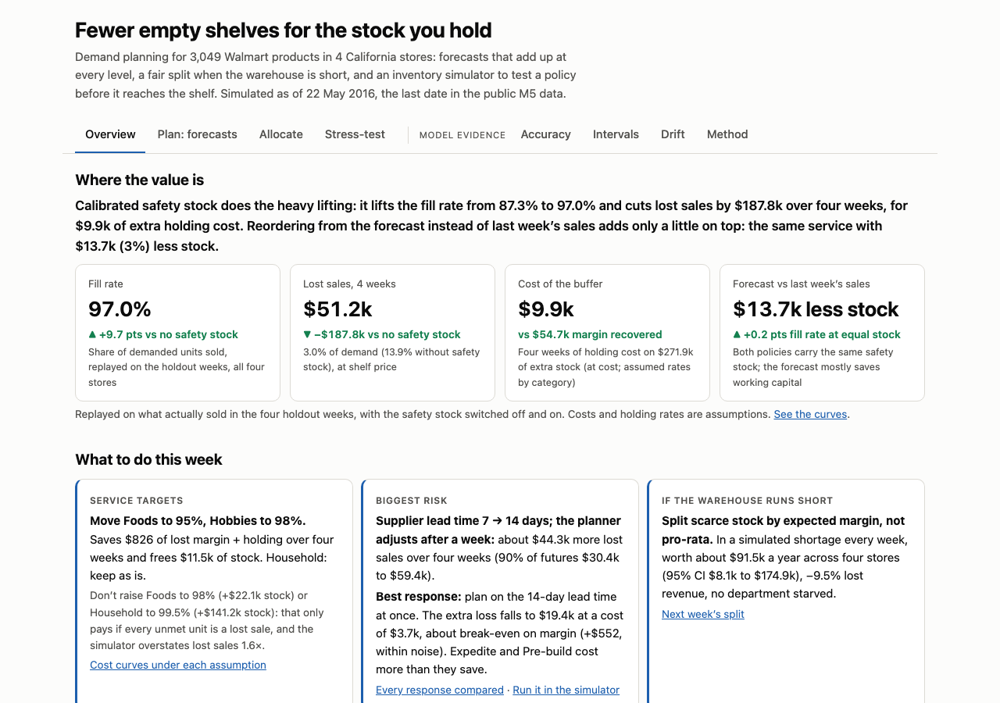
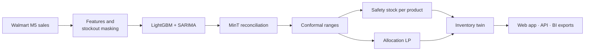
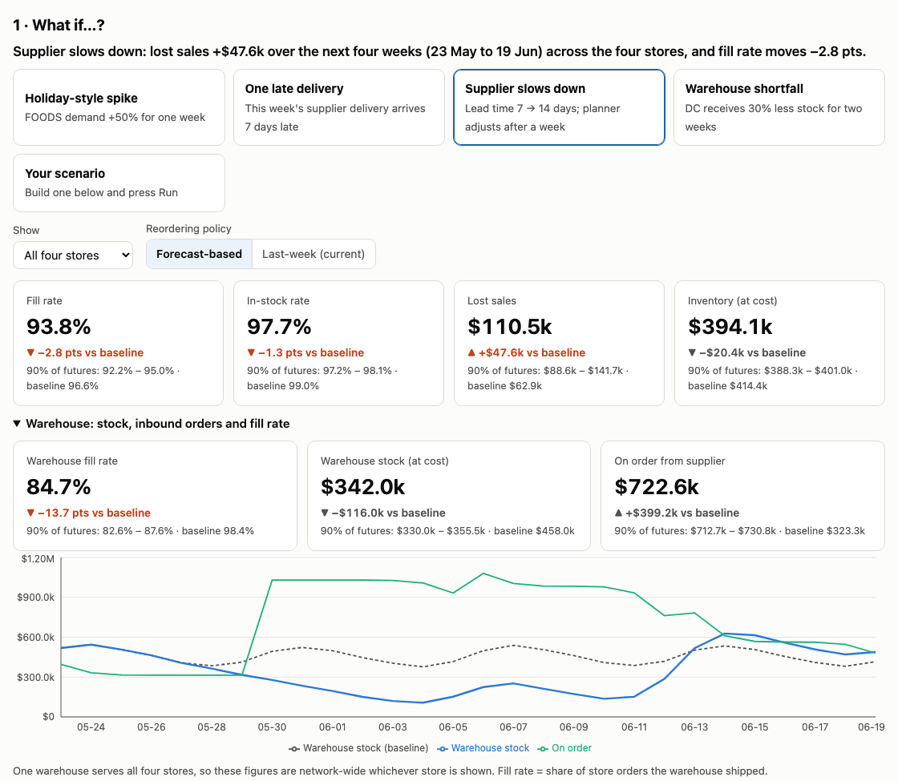

# Demand Planning Platform: Forecast, Allocate, Stress-Test

[](https://github.com/advaithvemurisai/demand-forecast-platform/actions/workflows/ci.yml)

**[▶ Open the live app](https://demand-forecast-platform.vercel.app/)**. No login, no backend: the inventory simulator runs in your browser.

An end-to-end retail planning system built on real Walmart sales (the M5 dataset): **3,049 products × 4 California stores**, forecast 28 days ahead, reconciled so every level of the plan adds up, allocated when the warehouse runs short, and stress-tested in a day-by-day inventory simulator of one warehouse and four stores.



## Results at a glance

All figures are from a holdout window that was never used for any modelling choice, across all four stores.

| Question | Answer |
|---|---|
| How accurate are the product forecasts? | 14% lower error than repeating last week's sales |
| Do the plans agree across levels? | Yes, exactly; category forecasts are also 15% more accurate than adding up product forecasts |
| Can the forecast ranges be trusted? | 95% ranges contain 94.1% of actual product sales, out of sample |
| What does the safety stock buy? | Fill rate **87.3% → 97.0%**; **$188k less lost sales** over four weeks for $9.9k of holding cost |
| When the warehouse is short, does smarter allocation pay? | About **$91k a year** more revenue than a proportional split; won 11 of 12 test weeks |
| Are today's service targets right? | Not quite: Foods 98%, Hobbies 99%, Household 99.5% saves about $31k a year |
| What is the biggest operational risk? | Supplier lead time: doubling it costs about $44k of sales over four weeks, even when the planner adjusts after a week |

## The finding I didn't expect

The first version compared forecast-based reordering with "last week's sales" and reported a **+12.8 point** fill-rate gain. A review pointed out that the baseline carried no safety stock. Once both policies get the same buffer:

- Forecast-based reordering fills **97.0% vs 96.8%** at the same $402k of stock.
- To match it, reordering from last week's sales needs about **3% more stock**.

Over a 3–8 day replenishment window, last week's sales rate is already a fair estimate for most products. **The value comes from calibrated safety stock, not from forecast-based reordering**, and the app and this README now say so. The simulator also plots fill rate against inventory for both policies, so they are compared at equal stock instead of at one hand-picked setting.

## The business problem

A retailer must decide how much of each product to stock and which stores get it.

1. **Plans at different levels disagree.** Buyers plan categories, store managers plan stores, supply chain plans the region. Forecast each separately and the numbers don't add up.
2. **Supply is often short.** When the warehouse can't cover every store, a proportional split ignores which units are likely to sell and what they're worth.
3. **Policies are tested on the shelf.** What a demand spike, a late supplier or a new service target does to stock and cash is usually found out the hard way.

## What's in it


```mermaid
flowchart LR
    D[Walmart M5 sales] --> F[Features and<br/>stockout masking]
    F --> M[LightGBM + SARIMA]
    M --> R[MinT reconciliation]
    R --> P[Conformal ranges]
    P --> S[Safety stock per product]
    P --> A[Allocation LP]
    S --> T[Inventory twin]
    A --> T
    T --> O[Web app · API · BI exports]
```

| Step | What it does | Method |
|---|---|---|
| **Forecast** | Daily sales for 12,196 product-store pairs | One global LightGBM model. Days a steady seller was probably out of stock are left out of training (Poisson zero-run test); closed days are forecast at zero, and events get distance-to-event features |
| **Reconcile** | One plan that adds up from product to state | MinT with out-of-sample weights, solved via the Woodbury identity so it scales to 12k series |
| **Quantify uncertainty** | A range around every forecast | Split-conformal intervals calibrated per segment (product speed × category) |
| **Safety stock** | A stock target per product | Conformal quantiles over each product's replenishment window; service targets by value × variability (ABC × XYZ) |
| **Allocate** | Who gets stock when supply is short | Scenario LP maximising expected margin against **net need** (what stores already hold counts), with a minimum fill so no department is starved |
| **Simulate** | What a policy or a disruption does to stock, service and cash | The inventory twin (below) |
| **Monitor** | When to retrain | PSI drift, accuracy decay, and a check that the twin still matches reality |

## The inventory twin

A day-by-day simulation of **supplier → one distribution centre → 4 stores × 3,049 products**: receive stock, sell (lost sales when the shelf is empty), reorder up to target, and ration the warehouse's stock when it is short.



What makes it more than a toy:

- **One shared warehouse.** All four stores run in one simulation. The warehouse holds stock per product and rations each product between the stores that ordered it.
- **Realistic warehouse policy.** Its safety stock pools the stores' demand risk (square-root law) and covers a supplier lead time that varies from order to order.
- **Correlated demand.** Each simulated future replays a past week of real sales shared by every product and store, so a bad week hits the whole network at once.
- **Costs at cost.** Inventory and holding cost use unit cost, not shelf price, with higher holding rates for perishable food.
- **Validated against history.** For each past window it predicts service levels from forecast data alone, then replays what actually sold.
- **One engine everywhere.** The pipeline, the API and the browser run the same numpy-only file, [`twin.py`](src/forecasting/twin.py). The browser runs it through Pyodide, and a test checks the two agree to 1e-6.

**What it found**

| Scenario (holdout, four weeks) | Extra lost sales | 90% of simulated futures |
|---|---|---|
| Supplier lead time 7 → 14 days, planner adjusts after a week | $44k | $30k – $59k |
| Holiday-style +50% Foods demand for a week | $21k | $16k – $28k |
| One supplier delivery a week late | $15k | $10k – $23k |
| Warehouse receives 30% less for two weeks | $8k | $4k – $13k |

How the warehouse shares a short product barely matters: by days of cover, proportionally or by value, each rule loses about $8.2k. Each product's shortfall is split between just four stores with similar cover.

**How far to trust it.** The predicted network fill rate is within 1.1 points of reality on average (holdout: 96.8% predicted vs 97.0% realised). Its 90% ranges are still too narrow, though: the realised value fell inside them in 5 of 24 network checks. Predicted dollar losses run about 1.7× high, because predicted demand is ~8% above observed sales, which stockouts themselves hold down. Read dollar figures as comparisons between policies, not as forecasts.

## Honest limitations

- **M5 has no inventory, lead-time, cost or case-pack data.** Starting stock, lead times and their spread, margins (which set unit costs) and holding rates are stated assumptions in `pipeline.Config` and `TwinConfig`. The warehouse → store leg has a fixed one-day lead time.
- **M5 records sales, not demand.** A zero can mean no demand or no stock. Probable stockouts are masked for steady sellers (≈4% of days), but some censoring remains, so accuracy is measured against sales that are themselves censored.
- **Product-level accuracy is modest.** Daily WMAPE is 0.74 (0.30–0.36 for fast sellers over their replenishment window, above 1.0 for sporadic ones).
- **Aggregate ranges under-cover.** At 95% nominal, store and category coverage is about 92.5%.
- **Allocation is planned by department** (28 store × department targets). Product-level sharing happens inside the twin.
- **Things that didn't help are reported and switched off:**
  - Temporal reconciliation made aggregate forecasts slightly worse.
  - An automatic bias-correction "override" only helps the products it flags.
- **California only.** Extending to all ten M5 stores needs more memory than a laptop.

## How it's evaluated

- **Backtests, then a holdout.** Three rolling 28-day backtests, then a final 28-day holdout. Model and reconciliation choices use backtests only.
- **Decision-level accuracy.** Forecasts are also scored over each product's replenishment window, with bias by weekday and event days and a tracking-signal list of products the forecast keeps missing in one direction.
- **Allocation backtest.** Weekly allocations are scored on realised sales, with stores carrying stock from week to week, and reported with a 95% confidence interval.
- **Tests.** 105 Python tests, including closed-form newsvendor checks, unit conservation and a full synthetic pipeline run. 14 web tests, including the Pyodide/CPython parity check. CI runs everything on every push.

## Repository layout

```
src/forecasting/
  pipeline.py        end-to-end run: features → models → reconciliation → intervals → allocation → twin
  reconciliation.py  MinT (Woodbury), bottom-up, top-down
  probabilistic.py   conformal intervals, ABC × XYZ safety stock
  allocation.py      scenario LP (PuLP + HiGHS)
  stockouts.py       probable-stockout detection
  twin.py            the inventory simulator (numpy only; also runs in the browser)
  twin_runs.py       validation, cost curves, policy curves, stress tests, watch-list
web/                 React + Vite + TypeScript app; simulator in a Pyodide web worker
api/                 FastAPI service: forecasts, metrics, live what-if simulations
notebooks/           walkthrough of every result
tableau/, looker_studio/   BI exports
data/dashboard/      committed results extract the app and API read
```

## Run it

```bash
python -m pip install -e ".[prophet,api,data,dev]"   # macOS: brew install libomp
python scripts/download_data.py                      # downloads and verifies the M5 data
python -m forecasting --states CA                    # prepare the data
python -m forecasting.pipeline                       # full run, ~25 min on a laptop
python -m pytest -q

# web app
python scripts/build_web_data.py                     # data/dashboard → web/public (~90 s of preset simulations)
cd web && npm install && npm run dev

# API
DATA_DIR=data/dashboard uvicorn api.main:app         # OpenAPI docs at /docs
```

Quick smoke run: `python -m forecasting.pipeline --max-items 300 --no-prophet --no-mlflow` (about 3 minutes; it overwrites `data/gold` and `data/dashboard`). Other flags: `--no-twin`, `--temporal`. To replay the weekly planning cycle: `python -m forecasting.replay --weeks 8`.

## Deploy

- **Web app (Vercel).** Import the repo with root directory `web/`. [`web/vercel.json`](web/vercel.json) builds the static data from `data/dashboard/` in a throwaway virtualenv, then builds the app, with cache headers and a content-security policy that allows only the Pyodide CDN. Every push to `main` redeploys.
- **API (optional).** [`api/requirements.txt`](api/requirements.txt) is a slim install with no modelling stack.
  - Set `DATA_DIR`, `ALLOWED_ORIGINS`, and `TRUSTED_PROXY_HOPS` when running behind a proxy.
  - `POST /twin/simulate` runs the whole network from `twin_inputs/network.npz` and returns KPIs for all stores and each store. It is capped at 50 futures and rate-limited.
- **CI.** [`.github/workflows/ci.yml`](.github/workflows/ci.yml) runs the Python tests, checks the browser snapshot is current, builds the web data, then lints, tests and builds the app.

**Stack:** Python · pandas · LightGBM · statsmodels · PuLP/HiGHS · MLflow · FastAPI · React · TypeScript · Recharts · Pyodide · Vercel · GitHub Actions
